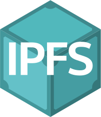

# bun-ipfs

<p align="center">
  
</p>

<p align="center">
  <strong>Upload files and folders to IPFS with QR codes, PDF reports, and IPNS publishing.</strong>
</p>

---

## Features

- Push files, folders, or zip archives to IPFS from **any directory**
- Automatic zip archive creation for folder uploads
- Multi-node pinning across configured IPFS nodes
- IPNS publishing for persistent, mutable names
- **QR code terminal output by default** (PNG, terminal display, PDF embedded)
- PDF reports with embedded QR codes saved to **current directory**
- SQLite history database for tracking all pushes
- Subcommands: `ping`, `history`, `find`, `gateway`, `env`, `config`
- Interactive TUI mode with setup wizard
- Direct CLI mode for scripting and automation
- Single-binary compilation for distribution
- **Works from anywhere** - no need to be in the project directory

## Requirements

- [Bun](https://bun.sh) runtime (v1.0+)
- Access to an IPFS node running the Kubo HTTP API (port 5001)
- `zip` command available on PATH
- `curl` command available on PATH

## Quick Start

```bash
# Clone and install
git clone https://github.com/tankbottoms/bun-ipfs.git
cd bun-ipfs
bun install

# Configure (interactive wizard)
bun run dev config

# Or configure manually
cp .env.sample .env
# Edit .env with your IPFS node details

# Push any folder from anywhere (QR codes shown by default, saves to current directory)
bun run dev /path/to/my-folder

# Push without QR codes
bun run dev ./my-folder --no-qr

# Push with reports saved to global directory
bun run dev ./my-folder --use-global-dir

# Interactive mode
bun run dev -i
```

## Installation

### From Source

```bash
git clone https://github.com/tankbottoms/bun-ipfs.git
cd bun-ipfs
bun install
```

### Build and Install Globally

#### macOS

```bash
bun run build:macos
# Builds, installs to /usr/local/bin/bun-ipfs, sets up state dir
```

Then use from anywhere:

```bash
cd ~/Documents
bun-ipfs ./my-project
# Reports and QR codes saved to ~/Documents/
```

#### Manual Installation

```bash
# Build for current platform
bun run build

# Install to /usr/local/bin
sudo cp bun-ipfs /usr/local/bin/
sudo chmod +x /usr/local/bin/bun-ipfs

# Or add to your PATH
export PATH="$PATH:$(pwd)"
```

#### Linux x64

```bash
bun run build:linux
# Creates bun-ipfs-linux binary
```

The output binary is standalone with the Bun runtime embedded.

## Usage

### Commands

```bash
bun-ipfs <path> [options]          Push a file, folder, or zip to IPFS
bun-ipfs push <path> [options]     Push (explicit subcommand)
bun-ipfs -i                        Interactive mode (TUI)
bun-ipfs env                       Print env vars and resolved config
bun-ipfs ping                      Test IPFS node connections
bun-ipfs history                   List previous pushes from database
bun-ipfs find <query>              Search previous pushes
bun-ipfs gateway                   Show current gateway
bun-ipfs gateway set <url>         Set default gateway
bun-ipfs config                    Run setup wizard
```

### Examples

```bash
# Push a folder from any directory (QR codes shown by default)
cd ~/Documents
bun-ipfs ./my-project
# Creates: my-project-report.json, YYYYMMDD-ipfs-ipns-my-project.pinned.pdf in ~/Documents

# Push without QR codes
bun-ipfs ./my-project --no-qr

# Push a single file from anywhere
bun-ipfs /path/to/paper.pdf
# Creates: paper-report.json, YYYYMMDD-ipfs-ipns-paper.pinned.pdf in current directory

# Push with global reports directory
bun-ipfs ./docs --use-global-dir
# Saves to ~/Documents/bun-ipfs/reports/ (macOS) or ~/.local/store/bun-ipfs/reports/ (Linux)

# Push with custom gateway
bun-ipfs ./docs -g https://dweb.link

# Quiet mode (machine-friendly, still shows QR codes)
bun-ipfs ./my-folder -q

# Quiet mode without QR codes
bun-ipfs ./my-folder -q --no-qr

# Check node connectivity
bun-ipfs ping

# Search previous pushes
bun-ipfs find attention

# View history
bun-ipfs history
```

### Interactive TUI Mode

```bash
bun-ipfs -i
```

The TUI provides:

- Multi-select folder picker (scans `upload/` directory)
- Gateway selector (ipfs.io, dweb.link, or custom)
- Connection status and confirmation prompts
- Spinner progress indicators for each step

### Options

| Flag | Description |
|------|-------------|
| `<path>` | File, folder, or .zip to upload (can be absolute or relative path) |
| `-i, --interactive` | Launch interactive TUI mode |
| `-g, --gateway <url>` | Public gateway for URL generation (default: `https://ipfs.io`) |
| `-q, --quiet` | Minimal output, suitable for scripting |
| `--no-qr` | Don't print QR codes to terminal (shown by default) |
| `--use-global-dir` | Save reports to global directory instead of current directory |
| `-v, --version` | Print version |
| `-h, --help` | Show help with usage examples |

## Configuration

### Setup Wizard

The easiest way to configure:

```bash
bun-ipfs config
```

Prompts for IPFS nodes, gateway, and writes config to `~/.local/store/bun-ipfs/bun-ipfs.json`.

### Config Resolution Order

1. CLI flags (`--gateway`, etc.)
2. Environment variables
3. `.env` in CWD (repo-mode)
4. `~/.local/store/bun-ipfs/.env`
5. `~/.local/store/bun-ipfs/bun-ipfs.json` (written by wizard)
6. SQLite `config` table
7. Built-in defaults

### Environment Variables

Create a `.env` file or set in your shell:

```bash
# IPFS nodes: name:hostname:ip:apiPort:gatewayPort:hasIpnsKeys
IPFS_NODES="node1:node1.local:10.0.1.10:5001:8080:true,local:localhost:127.0.0.1:5001:8080:false"

# Public gateways for URL generation
IPFS_PUBLIC_GATEWAYS="https://ipfs.io,https://dweb.link"

# Default gateway for CLI mode
IPFS_DEFAULT_GATEWAY="https://ipfs.io"
```

### IPFS Node Setup

The tool connects to IPFS nodes via the standard Kubo HTTP API:

```bash
# Start a local IPFS daemon
ipfs daemon

# Or via Docker
docker run -d --name ipfs \
  -p 5001:5001 \
  -p 8080:8080 \
  ipfs/kubo:latest
```

## Data Storage

By default, reports are saved to the **current working directory** where you run the command:

```
Current Directory (default)           Reports saved here by default
  <name>-report.json                  JSON report with all details
  YYYYMMDD-ipfs-ipns-<name>.pinned.pdf PDF report with QR codes

~/.local/store/bun-ipfs/              State directory (always)
  bun-ipfs.sqlite                     SQLite database (push history, config)
  bun-ipfs.json                       Config (from setup wizard)
```

Use `--use-global-dir` to save reports to a global directory instead:

```
~/Documents/bun-ipfs/reports/         Global reports directory (macOS, with --use-global-dir)
~/.local/store/bun-ipfs/reports/      Global reports directory (Linux, with --use-global-dir)
```

### Why Current Directory?

This design makes `bun-ipfs` a general-purpose tool you can use anywhere:

- **Project organization**: Reports stay with the content you're pushing
- **Easy cleanup**: Delete the folder, reports go with it
- **No configuration needed**: Works immediately from any directory
- **Flexible**: Use `--use-global-dir` when you want centralized storage

### JSON Report Schema

Each push also writes a JSON report to the reports directory:

```json
{
  "timestamp": "2026-02-04T18:30:45.000Z",
  "folderName": "my-project",
  "cids": {
    "folder": "bafybeig...",
    "zip": "bafybeih..."
  },
  "ipns": {
    "keyName": "push-my-project",
    "name": "k51qzi5uqu5d..."
  },
  "urls": {
    "ipfs": "https://ipfs.io/ipfs/bafybeig.../",
    "zip": "https://ipfs.io/ipfs/bafybeih...",
    "ipns": "https://ipfs.io/ipns/k51qzi5uqu5d.../"
  },
  "stats": {
    "fileCount": 12,
    "folderSize": 2048576,
    "zipSize": 1024288
  }
}
```

## Testing

### Run Tests

```bash
# Run the integration test
bun test

# Or use the test script
bash scripts/test-upload.sh
```

### Manual Testing

```bash
# Test from the project directory
bun run dev ./upload/attention

# Test from another directory with absolute path
cd /tmp
/path/to/bun-ipfs/bun-ipfs ~/Documents/my-folder

# Test with global installation
sudo cp bun-ipfs /usr/local/bin/
cd ~
bun-ipfs ./Desktop/test-folder
```

## Sample Folder

The `upload/attention/` folder contains the "Attention Is All You Need" paper (Vaswani et al., 2017) as a sample upload target:

```bash
# From project directory
bun run dev ./upload/attention

# After installation, from anywhere
cd /tmp
bun-ipfs ~/path/to/bun-ipfs/upload/attention
```

## Claude Code Integration

A Claude Code skill definition is available in `docs/claude-skill.md`. To use it, say:

> "use the ipfs push skill"

See the [skill documentation](docs/claude-skill.md) for arguments and configuration.

## Project Structure

```
bun-ipfs/
  src/
    index.ts              Entry point, command dispatch
    cli.ts                Argument parsing and help output
    config.ts             Config resolution chain
    db.ts                 SQLite database (bun:sqlite)
    ipfs.ts               IPFS HTTP API operations
    zip.ts                Archive and file utilities
    qr.ts                 QR code generation (files, buffers, terminal)
    report.ts             PDF report generation (pdf-lib)
    wizard.ts             TUI setup wizard
    types.ts              TypeScript interfaces
    commands/
      env.ts              Print environment command
      ping.ts             Test IPFS connections
      history.ts          List previous pushes
      find.ts             Search pushes
      gateway.ts          Get/set default gateway
  scripts/
    build-macos.sh        Build + install for macOS ARM64
    test-upload.sh        Integration test script
  docs/
    manual.md             Detailed usage manual
    claude-skill.md       Claude Code skill definition
  upload/
    attention/            Sample folder with test data
  .env.sample             Environment configuration template
```

## License

MIT

## Author

tankbottoms.eth
